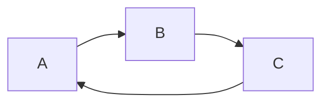

# Welcome to Slidev

A presentation framework for developers

---

# What is Slidev?

<v-clicks>

- 📝 **Text-based** - Focus on content with markdown
- 🎨 **Themeable** - Themes can be shared and used with npm packages  
- 🧑‍💻 **Developer Friendly** - Code highlighting, live coding with autocompletion
- 🤹 **Interactive** - Embedding Vue components seamlessly
- 🎥 **Recording** - Built-in recording and camera view
- 📤 **Portable** - Export into PDF, PNGs, or even a hostable SPA

</v-clicks>

<!--
This slide uses v-clicks to reveal each feature one by one
-->

---

# Quick Start

<div v-click>

Install Slidev globally or use npx:

```bash
npm install -D @slidev/cli
npx slidev
```

</div>

<div v-click>

Create your first slide deck:

```markdown
# Hello World

This is my first slide!

---

# Page 2

The second slide!
```

</div>

---
layout: center
---

# Simple Diagram Example



A simple flow diagram

---
layout: center
---

# Ready to Get Started?

<div v-click>

Documentation: [sli.dev](https://sli.dev)

</div>

<div v-click>

Try it yourself and explore more features!

</div>

<!--
This is a note for the presenter
-->

---
layout: end
---

# Thank You!

<div v-after>

Happy Presenting with Slidev! 🎉

</div>